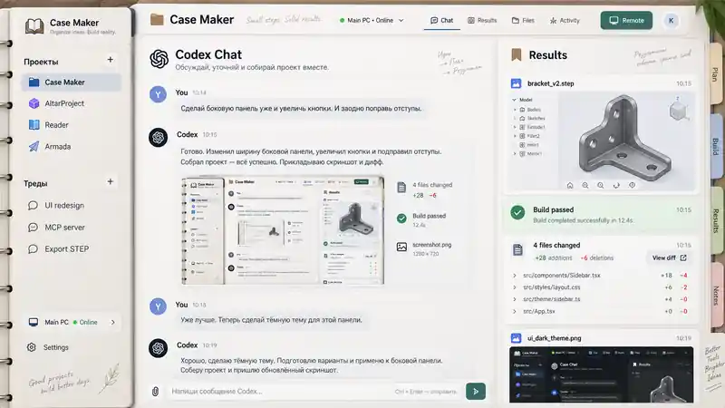
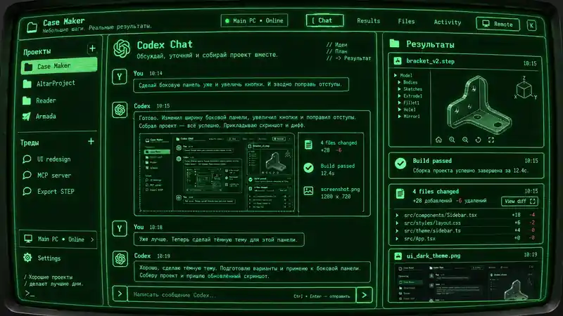
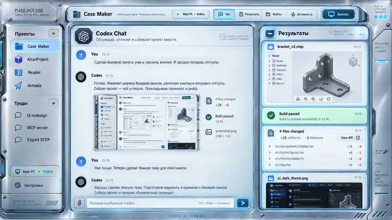

# Codex Web Interface

A private, iPad-first web workspace for using Codex on machines that are **not exposed to the Internet**.

The primary target is a **13-inch iPad in landscape**. The Linux server is the only public endpoint. It serves the PWA, authenticates the user, keeps workspace state, and bridges Codex/Remote Desktop to execution machines over the trusted LAN (or Tailnet later).

## Core idea

```text
                         Internet
                            |
                     HTTPS / WSS :443
                            |
                     +--------------+
                     |  Linux Hub   |
                     |              |
                     | Web/PWA      |
                     | Auth         |
                     | Codex bridge |
                     | Results      |
                     | Notes/Plan   |
                     | Remote bridge|
                     +------+-------+
                            |
                    trusted LAN only
                 +----------+----------+
                 |                     |
          +------+-------+      +------+-------+
          | Windows PC   |      | Linux Server |
          | primary v1   |      | local mode   |
          |              |      |              |
          | Codex        |      | Codex        |
          | projects     |      | projects     |
          | build tools  |      | tools        |
          | desktop      |      | desktop      |
          +--------------+      +--------------+
```

### Non-negotiable network rule

**Only the Hub is Internet-facing.** The Windows PC never exposes Codex, RDP/VNC, a custom web server, or a custom agent directly to the Internet.

For the primary Windows flow, the Hub launches `codex app-server` remotely through OpenSSH and communicates over stdio. No Codex TCP/WebSocket listener is required on the PC.

## What the UI should feel like

The application is a work console, not a browser IDE.

```text
+----------------+-----------------------------+-----------------------+
| PROJECTS       |          CODEX CHAT         |       RESULTS         |
|                |                             |                       |
| Case Maker     | Human conversation stays   | screenshots           |
| AltarProject   | clean and readable.         | build/test status     |
| Reader         |                             | file changes / diff   |
|                |                             | generated artifacts   |
| THREADS        |                             | previews               |
| UI redesign    |                             |                       |
| MCP            |                             | Results / Files /     |
| Export         |                             | Activity / Remote     |
+----------------+-----------------------------+-----------------------+
```

- **Left:** projects and threads; later Notes, Plan, Machines, Settings.
- **Center:** Codex conversation only. Avoid filling the chat with logs and screenshots.
- **Right:** chronological result feed. It can switch to Files, Activity, or Remote Desktop.
- **Remote:** an occasional manual-control mode, not the main workflow.

## Primary platform

- 13-inch iPad, landscape, installed as a standalone PWA.
- Touch-first. No hover-only functionality.
- Independent scrolling for navigation, chat, and results.
- Desktop browsers are supported, but the iPad layout is the design reference.
- Portrait mode uses tabs instead of forcing three narrow columns.

## Primary execution path (v1)

**iPad -> Linux Hub -> LAN -> Windows PC -> Codex**

1. User opens a project on the PWA.
2. Hub resolves the project's machine and working directory.
3. Hub opens/reuses an SSH connection to the Windows PC.
4. Hub starts `codex app-server` using the Windows user's existing Codex environment.
5. Hub adapts the Codex protocol into a stable internal API for the frontend.
6. Browser can disconnect without killing the Hub-owned Codex session.
7. Results are stored/indexed by the Hub and shown separately from chat.
8. When manual interaction is needed, the right pane switches to browser Remote Desktop.

A second backend runs Codex locally on the Linux Hub using the same frontend and internal interfaces.

## Remote Desktop

Preferred path when the Windows edition supports RDP:

```text
Browser -> Hub -> Guacamole/guacd -> LAN -> Windows RDP
```

The remote protocol is abstracted so a VNC-compatible fallback can be used where Windows RDP hosting is unavailable.

Important Windows caveat: processes started through OpenSSH do not automatically share the visible interactive desktop session. v1 must **not** assume that a GUI launched from an SSH Codex session will appear in Remote Desktop. A small, local-only Windows companion may be added later specifically for interactive-session launching/capture; it must not expose a network listener.

## Platform direction

The long-term goal is a personal development workspace that can grow around Codex without turning into a full IDE:

- project notes and pinned context;
- plan/tasks;
- machine status;
- files and Git summaries;
- build/test results;
- screenshots and generated artifacts;
- Remote Desktop;
- activity history;
- optional additional execution machines over Tailscale.

Projects are the primary object. Machines are infrastructure behind projects.

## Technology direction

Initial implementation target:

- TypeScript monorepo;
- React PWA frontend;
- Node.js + Fastify Hub;
- WebSocket for live Hub <-> browser events;
- SQLite for Hub-owned state;
- system OpenSSH client for remote machine transport;
- Codex App Server over stdio behind a compatibility adapter;
- Apache Guacamole/`guacd` for browser Remote Desktop;
- semantic design tokens for themes.

Do not couple the frontend directly to raw Codex App Server messages.

## Themes

The same functional layout supports multiple visual skins:

1. **Digital Organizer** — clean notebook/organizer language, tabs and paper-like hierarchy.
2. **Green CRT Terminal** — phosphor glow, subtle scanlines and curved-screen effect without sacrificing text clarity.
3. **Hi-Tech 2000s** — premium early-2000s workstation/device UI, recessed displays and hardware-like panels.

Reference images are in [`references/`](references/).

| Organizer | Green CRT | Hi-Tech 2000s |
| --- | --- | --- |
|  |  |  |

## Documentation

Start here before implementing:

- [`AGENTS.md`](AGENTS.md) — implementation rules for Codex/agents.
- [`docs/VISION.md`](docs/VISION.md) — product intent and non-goals.
- [`docs/DECISIONS.md`](docs/DECISIONS.md) — fixed decisions and open deployment choices.
- [`docs/ARCHITECTURE.md`](docs/ARCHITECTURE.md) — Hub, transports, sessions and storage.
- [`docs/CODEX_INTEGRATION.md`](docs/CODEX_INTEGRATION.md) — App Server boundary and Windows details.
- [`docs/REMOTE_DESKTOP.md`](docs/REMOTE_DESKTOP.md) — Remote provider design.
- [`docs/UX.md`](docs/UX.md) — iPad-first layout and behavior.
- [`docs/SECURITY.md`](docs/SECURITY.md) — security invariants.
- [`docs/DEPLOYMENT.md`](docs/DEPLOYMENT.md) — intended Linux/Windows setup and network shape.
- [`docs/PLATFORM_MODULES.md`](docs/PLATFORM_MODULES.md) — Notes, Plan, Machines, Files/Git and other gradual extensions.
- [`docs/ROADMAP.md`](docs/ROADMAP.md) — staged implementation plan and MVP acceptance criteria.
- [`config.example.yaml`](config.example.yaml) / [`.env.example`](.env.example) — configuration shape with placeholders only.

## Current status

Planning/design baseline is complete. No production implementation exists yet. The next step is repository scaffolding and the first end-to-end remote Codex connection from the Linux Hub to the Windows PC.